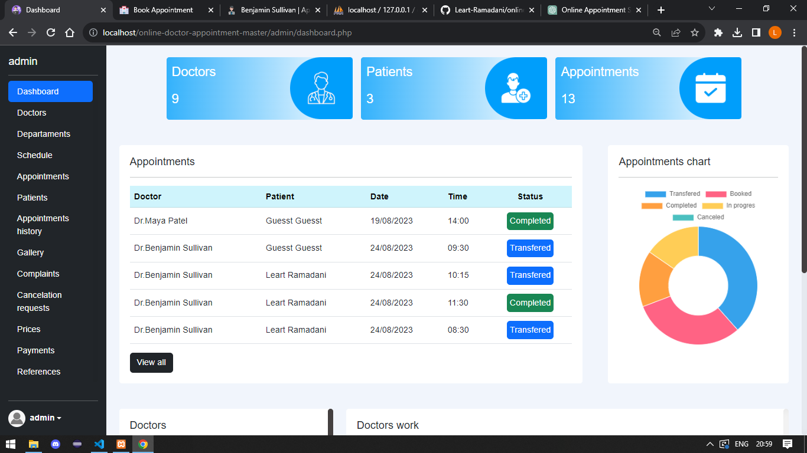
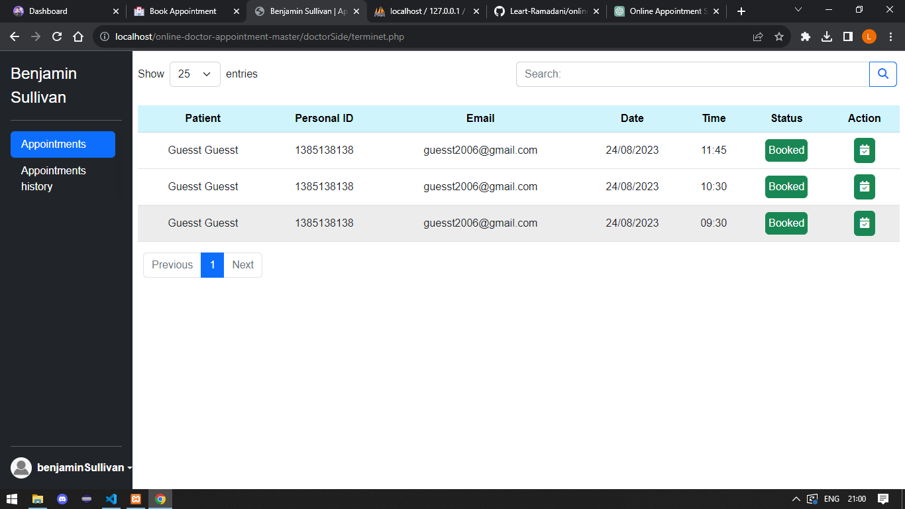
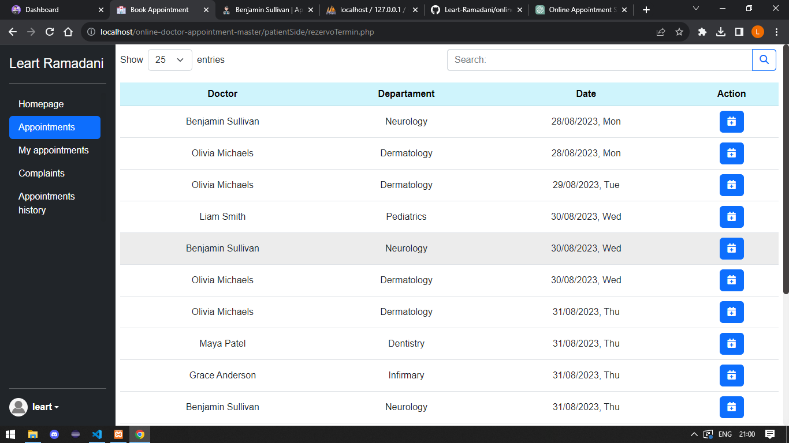

# Online Appointment System
- Table of Contents
- Introduction
- System Overview
- Admin Side
- Doctor Side
- Patient Side
- Open Accounts
### Introduction
Welcome to the Online Appointment System! This project serves as a solution for medical institutions, including clinics and hospitals, by providing an efficient way for patients to book appointments with doctors online. The system is designed to streamline the appointment scheduling process, allowing patients to select their preferred doctor, book appointments, manage their appointments, and more.

### System Overview
The Online Appointment System is divided into three main user roles: Administrator, Doctor, and Patient. Each role has specific functionalities tailored to their needs.

### Admin Side
- Add, update, or delete doctors and their information.
- Manage departments and their details.
- Plan and manage doctor schedules.
- View and manage appointments booked by patients.
- Access patient data for administrative purposes.
- Review the history of completed appointments.
- Manage photos displayed in the gallery section.
- Handle patient complaints and feedback.
- Approve or reject requests for appointment cancellations.

### Doctor Side
- View appointments booked with the doctor.
- Mark appointments as completed after check-ups.
- Schedule follow-up appointments for patients.

### Patient Side
- Register an account using email verification.
- Update account information.
- Browse through the gallery.
- Book appointments online with preferred doctors.
- View their upcoming appointments.
- Lodge complaints or provide feedback.
- Request appointment cancellations.
- Receive email notifications regarding appointment cancellation requests.
- Reset passwords through email links.
- Review appointment history.

## Open Accounts
### Admin Account
- Username: admin
- Password: admin

### Doctor Account
- Username: mayaPatel
- Password: mayaPatel

### Patient Account
To access all features, create an account with a valid email to verify the account and receive appointment details.

Thank you for choosing our Online Appointment System. We hope this system enhances your experience and simplifies appointment management for both patients and medical staff. For any questions or concerns, please contact our support team.

<h3 align="left">Languages and Tools:</h3>

 
     
         
     
     
     
     
     

<i>Note: Internet access is required for the system to function properly.</i>